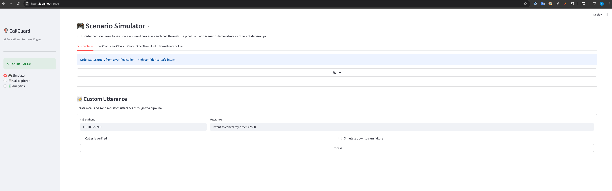
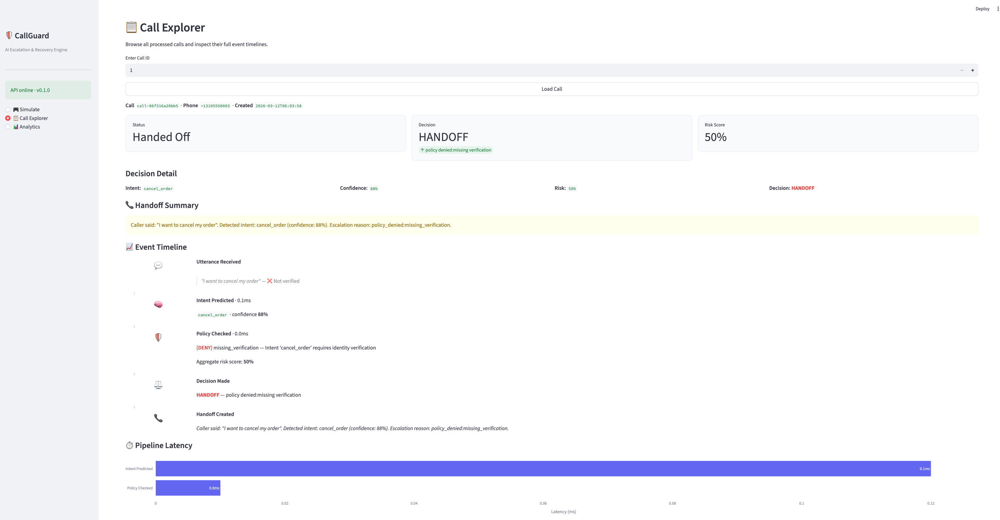
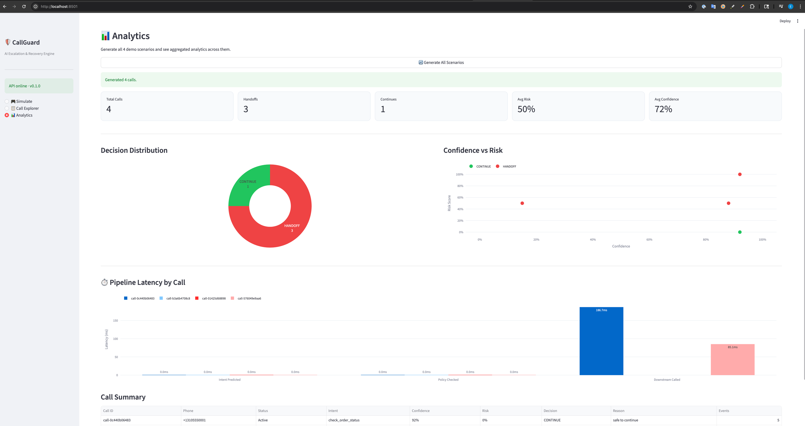
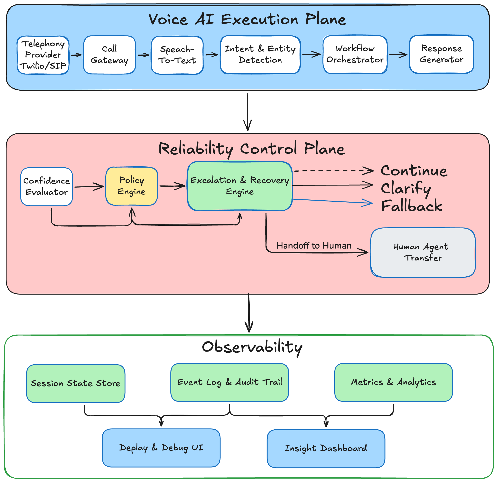

# CallGuard

**AI Escalation & Recovery Engine for Voice Agents**







---

## Why This Matters



Voice AI is moving fast — contact centers are projected to automate over 80% of routine calls by 2027. But automation without guardrails is a liability. A single mishandled cancellation, an unverified identity change, or a hallucinated policy answer can cost a company real money and erode customer trust overnight.

The industry's core problem isn't building voice bots — it's knowing **when the bot should stop talking and hand the call to a human**. Most production incidents trace back to the same gap: there's no reliability layer between the AI and the caller. No confidence threshold. No policy gate. No audit trail.

CallGuard fills that gap. It sits between the voice agent and the end user, evaluating every utterance through an intent-prediction, policy-check, and risk-scoring pipeline, then making a routing decision: **continue**, **clarify**, **fallback**, or **handoff** to a human operator. Every step is recorded, every decision is explainable, and the entire pipeline is observable in real time.

This is *not* a voice bot — it's the safety and observability layer that makes voice bots production-ready.

---

## Architecture

```
┌──────────────────────────────────────────────────────────────┐
│                      Execution Plane                         │
│  Utterance intake → Intent prediction → Entity extraction    │
└──────────────────────┬───────────────────────────────────────┘
                       │
┌──────────────────────▼───────────────────────────────────────┐
│                     Reliability Plane                         │
│  Policy checks → Risk scoring → Escalation decision          │
│  → Handoff summary generation → Event timeline recording     │
└──────────────────────────────────────────────────────────────┘
```

The codebase follows a **3-layer architecture**:

| Layer | Responsibility | Key modules |
|-------|---------------|-------------|
| **API** | HTTP endpoints, request validation | `app/api/routes/` |
| **Domain** | Business logic, decision engine | `app/domain/services/`, `app/domain/rules/` |
| **Persistence** | Data storage, repositories | `app/repositories/`, `app/db/` |

---

## Core Decision Logic

```python
def decide(intent, confidence, policy_result, downstream_failed):
    if downstream_failed         → HANDOFF  (downstream_api_failed)
    if policy has denials        → HANDOFF  (policy_denied:...)
    if confidence < 0.50         → HANDOFF  (very_low_confidence)
    if confidence < 0.75         → CLARIFY  (low_confidence)
    else                         → CONTINUE (safe_to_continue)
```

Every step is recorded as an **event** with `latency_ms`, creating a full observability timeline per call.

---

## Demo Scenarios

| Scenario | What happens | Expected decision |
|----------|-------------|-------------------|
| `safe_continue` | "Where is my order #12345?" (verified) | **continue** |
| `low_confidence_clarify` | "Hmm, something about my thing" | **clarify** |
| `cancel_order_unverified` | "I want to cancel my order" (unverified) | **handoff** |
| `downstream_failure` | Valid order query, but API times out | **handoff** |

---

## API Endpoints

| Method | Path | Description |
|--------|------|-------------|
| `GET` | `/health` | Service health check |
| `POST` | `/api/v1/calls` | Create a new call session |
| `POST` | `/api/v1/calls/{id}/utterances` | Process an utterance through the pipeline |
| `GET` | `/api/v1/calls/{id}` | Get full call detail with event timeline |
| `POST` | `/api/v1/simulate/scenario` | Run a predefined demo scenario |
| `GET` | `/api/v1/simulate/scenarios` | List available scenarios |

---

## How to Run Locally

### Prerequisites

- Python 3.12+
- [uv](https://docs.astral.sh/uv/)

### Setup

```bash
# Install dependencies
uv sync

# Copy environment config
cp .env.example .env

# Run database migrations
uv run alembic upgrade head

# Start the server
uv run uvicorn app.main:app --reload
```

The API will be available at `http://localhost:8000`. Open `http://localhost:8000/docs` for the interactive Swagger UI.

### Dashboard

In a second terminal, launch the Streamlit dashboard:

```bash
uv run streamlit run dashboard.py
```

Open `http://localhost:8501`. The dashboard has three pages:

- **Simulate** — run predefined scenarios or custom utterances and see the full pipeline result with event timeline, decision detail, and latency chart
- **Call Explorer** — look up any call by ID and inspect its full event history
- **Analytics** — generate all scenarios at once and see aggregated charts: decision distribution donut, confidence-vs-risk scatter, per-step latency comparison, and a summary table

### Quick Demo

```bash
# Run all 4 demo scenarios at once:

# 1. Safe continue — order status query
curl -s -X POST http://localhost:8000/api/v1/simulate/scenario \
  -H "Content-Type: application/json" \
  -d '{"scenario": "safe_continue"}' | python -m json.tool

# 2. Low confidence — vague utterance triggers clarify
curl -s -X POST http://localhost:8000/api/v1/simulate/scenario \
  -H "Content-Type: application/json" \
  -d '{"scenario": "low_confidence_clarify"}' | python -m json.tool

# 3. Risky action — cancel order without verification
curl -s -X POST http://localhost:8000/api/v1/simulate/scenario \
  -H "Content-Type: application/json" \
  -d '{"scenario": "cancel_order_unverified"}' | python -m json.tool

# 4. Downstream failure — API timeout triggers handoff
curl -s -X POST http://localhost:8000/api/v1/simulate/scenario \
  -H "Content-Type: application/json" \
  -d '{"scenario": "downstream_failure"}' | python -m json.tool
```

### Run Tests

```bash
uv run pytest -v
```

---

## Tech Stack

- **FastAPI** — async HTTP framework
- **Pydantic v2** — request/response validation
- **SQLAlchemy 2.0** — async ORM with mapped columns
- **SQLite** (aiosqlite) — zero-config persistence, swappable for Postgres
- **Alembic** — schema migrations
- **structlog** — structured JSON logging
- **pytest + httpx** — async integration tests

---

## Project Structure

```
app/
├── api/
│   ├── routes/
│   │   ├── calls.py          # Call CRUD + utterance processing
│   │   ├── health.py         # Health check
│   │   └── simulate.py       # Scenario simulation
│   └── dependencies.py       # FastAPI dependency injection
├── core/
│   ├── config.py             # Pydantic settings
│   ├── database.py           # Async engine + session
│   └── logging.py            # structlog setup
├── domain/
│   ├── enums.py              # CallStatus, IntentName, DecisionType, ...
│   ├── services/
│   │   ├── intent_service.py      # Rule-based NLU
│   │   ├── policy_service.py      # Policy evaluation + risk scoring
│   │   ├── escalation_service.py  # Core decision engine
│   │   ├── handoff_service.py     # Operator summary generation
│   │   ├── downstream_adapter.py  # Mock external API
│   │   └── simulation_service.py  # Pipeline orchestrator
│   └── rules/
│       └── policy_rules.py        # Business rule definitions
├── repositories/
│   ├── call_repository.py
│   ├── event_repository.py
│   └── decision_repository.py
├── schemas/                  # Pydantic request/response models
├── db/
│   └── models.py             # SQLAlchemy ORM models
└── main.py                   # FastAPI app entry point
```
